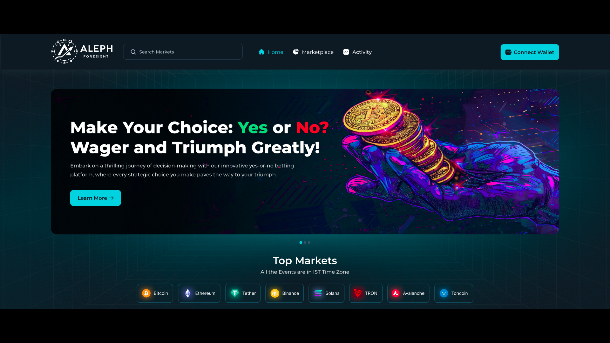

<a name="readme-top"></a>

<!-- PROJECT LOGO -->
<br />
<div align="center">
  <a href="https://alephzero.org/">
    
  </a>

  <h3 align="center">Aleph-foresight-backend</h3>

  <p align="center">
     Aleph Foresight is a decentralized prediction market platform built on AlephZero blockchain. The backend is designed to manage the platform's core functionalities, enabling users to create and participate in betting events securely and transparently.
    <br />
    <a href="https://alephzero.org/"><strong>Aleph Foresight »</strong></a>
    <br />
  </p>
</div>


<!-- TABLE OF CONTENTS -->
<details>
  <summary>Table of Contents</summary>
  <ol>
    <li>
      <a href="#about-the-project">About The Project</a>
      <ul>
        <li><a href="#built-with">Built With</a></li>
      </ul>
    </li>
    <li>
      <a href="#getting-started">Getting Started</a>
      <ul>
        <li><a href="#prerequisites">Prerequisites</a></li>
        <li><a href="#installation">Installation</a></li>
      </ul>
    </li>
    <li><a href="#license">License</a></li>
    <li><a href="#acknowledgments">Acknowledgments</a></li>
  </ol>
</details>


<!-- ABOUT THE PROJECT -->
## About The Project



Aleph Foresight is a decentralized betting and event management platform built on  blockchain. It allows users to create events, place bets, and manage various aspects of the betting process. Here are some key features and functionalities:

1. **Event Creation:** Users or admins can create events, specifying details like expiration time and betting closure time. The platform supports fee structures for both event creation and platform usage.

2. **Betting:** Users can place bets on events with options such as "Yes" or "No". The platform tracks betting pools and individual user bets securely.

3. **Event Management:** Admins can set or update event results, adjust platform fees, and manage event expiration and bet closure times.

4. **Payouts and Claims:**  After an event concludes, users can claim rewards based on their bets and the event result. The platform handles payouts to users, admin rewards, and event creation fees.
   
5. **Dispute Resolution:** Users can raise disputes if they believe there’s an issue with an event's outcome, within a specific time frame.
   
6. **Administration and Upgrades:** The platform includes administrative controls for setting fees and upgrading the smart contract for easy navigation and exploration.


### Built With

* [![NodeJS][NodeJS]][Node-url]
* [![ExpressJs][ExpressJS]][Express-url]
* [![MongoDB][MongoDB]][MongoDB-url]
* [![Typescript][Typescript]][Typescript-url]
* [![Redis][Redis]][Redis-url]
* [![Docker][Docker]][Docker-url]

<!-- GETTING STARTED -->
## Getting Started

To set up the project follow the instructions:

### Prerequisites

* NodeJS - [Installation Guide](https://nodejs.org/en/download/package-manager)
* Docker - [Installation Guide](https://docs.docker.com/get-docker/)

### Installation


1. Enter the env in `src/config/local.env`
   ```sh
   PORT=XXXX
   ADMIN=XXXXXXXXX
   SOCKET_HOST=XXXXXXXXXXX
   AWS_ACCESS_KEY_ID=XXXXXXXXX
   AWS_SECRET_ACCESS_KEY=XXXXXXXXXX
   S3_REGION=XXXXXX
   S3_BUCKET=XXXXXXXX
   REDIS_URL=XXXXXXXXXXX
   IPFSHOST=XXXXXXXXXXX
   IPFSURL=XXXXXXXX
   CONTRACTADDRESS=XXXXXXXXXX
   MONGO_CONNECTION_URI=XXXXXXXXXXXXXX
   S3_BUCKET_URL=XXXXXXXXXXX
   CLOUDFRONT_URL=XXXXXXXXX
   ORIGIN=XXXXXXX
   ```
2. Run docker file
   ```sh
   docker build .
   ```   
3. Create docker containers from docker compose file
   ```sh
   docker compose up -d
   ```  
4. Install dependencies
   ```sh
   npm install
   ```   
5. Run the app in development mode
   ```sh
   npm run dev
   ```  

<!-- LICENSE -->
## License

Distributed under the Apache License. See `LICENSE.txt` for more information.


<!-- ACKNOWLEDGMENTS -->
## Acknowledgments

* [Typescript](https://www.typescriptlang.org/)
* [Web3](https://web3js.readthedocs.io/en/v1.10.0/)

<p align="right">(<a href="#readme-top">back to top</a>)</p>

<!-- MARKDOWN LINKS & IMAGES -->

[NodeJS]: https://img.shields.io/badge/nodejs-green?style=for-the-badge&logo=nodedotjs&logoColor=white
[Node-url]: https://nodejs.org/en/docs
[ExpressJS]: https://img.shields.io/badge/expressjs-grey?style=for-the-badge&logo=expressdotjs&logoColor=white
[Express-url]: https://expressjs.com/
[MongoDB]: https://img.shields.io/badge/MongoDB-%234ea94b.svg?style=for-the-badge&logo=mongodb&logoColor=white
[MongoDB-url]:https://www.mongodb.com/docs/
[Typescript]: https://img.shields.io/badge/typescript-blue?style=for-the-badge&logo=typescript&logoColor=white
[Typescript-url]: https://www.typescriptlang.org/
[Redis]:https://img.shields.io/badge/redis-%23DD0031.svg?style=for-the-badge&logo=redis&logoColor=white
[Redis-url]:https://redis.io/docs/latest/
[Docker]:https://img.shields.io/badge/docker-%230db7ed.svg?style=for-the-badge&logo=docker&logoColor=white
[Docker-url]:https://docs.docker.com/

